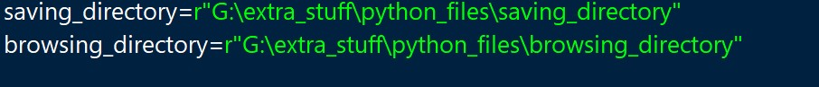

# CroppingDataset
## [Youtube Video](https://youtu.be/r6YVoyKSZhs)
Here's the simple python code to manually crop the images and save it to desired directory location.

You may change the location accordingly and then run the program. Here's a simple look of how cropping works:

